# ER 图

GitHub 可以直接渲染下面的 Mermaid。`question_id / tag_id / entity_id / target_id` 是 PgSQL UUID 的字符串引用，不是 SQLite 外键。

```mermaid
erDiagram
    user_profile ||--o{ learning_session : owns
    user_profile ||--o{ conversation_turn : owns
    user_profile ||--o{ question_attempt : performs
    user_profile ||--o{ mastery_state : has
    user_profile ||--o{ error_pattern_state : has
    user_profile ||--o{ review_schedule : has
    user_profile ||--o{ review_event : performs
    user_profile ||--o{ context_summary : has
    user_profile ||--o{ agent_memory_item : has
    user_profile ||--o{ active_context_ref : has
    user_profile ||--o{ agent_runtime_state : has
    user_profile ||--o{ workflow_run : starts
    user_profile ||--o{ tool_call_log : owns
    user_profile ||--o{ pending_state_delta : owns
    user_profile ||--o{ local_event_log : owns

    learning_session ||--o{ conversation_turn : contains
    learning_session ||--o{ question_attempt : contains
    learning_session ||--o{ review_event : contains
    learning_session ||--o{ context_summary : scopes
    learning_session ||--o{ active_context_ref : scopes
    learning_session ||--o{ agent_runtime_state : scopes
    learning_session ||--o{ workflow_run : scopes

    question_attempt ||--o{ question_attempt_tag : snapshots
    question_attempt ||--o{ mastery_event : evidences
    question_attempt ||--o{ pending_state_delta : evidences
    mastery_state ||--o{ mastery_event : changes
    review_schedule ||--o{ review_event : schedules
    review_event ||--o{ mastery_event : evidences
    review_event ||--o{ pending_state_delta : evidences
    workflow_run ||--o{ tool_call_log : records
    workflow_run ||--o{ pending_state_delta : proposes

    user_profile {
      text user_id PK
      text current_subject
      text current_stage
      text preference_json
    }
    learning_session {
      text id PK
      text user_id FK
      text session_type
      text status
      text subject
      text topic
    }
    conversation_turn {
      text id PK
      text session_id FK
      text user_id FK
      text role
      text content_type
      text related_question_id
      text related_attempt_id FK
    }
    question_attempt {
      text id PK
      text user_id FK
      text session_id FK
      text question_id "PgSQL UUID string"
      int is_correct
      real score
      text main_error_type
      text state_applied_at
    }
    question_attempt_tag {
      text id PK
      text attempt_id FK
      text tag_type
      text tag_id "PgSQL UUID string"
      text tag_name
      text role
      real weight
      real confidence
    }
    mastery_state {
      text id PK
      text user_id FK
      text entity_type
      text entity_id "PgSQL UUID string"
      text entity_name
      real mastery_score
      real confidence_score
      text state_label
      text next_review_at
    }
    mastery_event {
      text id PK
      text user_id FK
      text mastery_state_id FK
      text attempt_id FK
      text review_event_id FK
      real old_mastery_score
      real new_mastery_score
      text delta_reason
    }
    error_pattern_state {
      text id PK
      text user_id FK
      text error_type
      text error_pattern_name
      int occurrence_count
      real severity_score
      real resolved_score
      text status
    }
    review_schedule {
      text id PK
      text user_id FK
      text target_type
      text target_id
      text target_name
      real priority_score
      text due_at
      real interval_days
      real ease_factor
    }
    review_event {
      text id PK
      text user_id FK
      text session_id FK
      text schedule_id FK
      text target_type
      text target_name
      text result
      text state_applied_at
    }
    context_summary {
      text id PK
      text user_id FK
      text session_id FK
      text summary_scope
      text summary_text
      text structured_json
      text status
    }
    agent_memory_item {
      text id PK
      text user_id FK
      text memory_type
      text title
      real importance_score
      real freshness_score
      text expires_at
      text status
    }
    active_context_ref {
      text id PK
      text user_id FK
      text session_id FK
      text ref_type
      text ref_id
      text status
    }
    agent_runtime_state {
      text id PK
      text user_id FK
      text session_id FK
      text agent_name
      text state_key
      text state_value_json
      text status
    }
    workflow_run {
      text id PK
      text user_id FK
      text session_id FK
      text workflow_name
      text status
      text current_step
    }
    tool_call_log {
      text id PK
      text workflow_run_id FK
      text user_id FK
      text session_id FK
      text tool_name
      text status
      int latency_ms
    }
    pending_state_delta {
      text id PK
      text user_id FK
      text workflow_run_id FK
      text attempt_id FK
      text review_event_id FK
      text delta_type
      text validation_status
    }
    local_event_log {
      text id PK
      text user_id FK
      text session_id FK
      text event_type
      text aggregate_type
      text aggregate_id
    }
    system_kv {
      text key PK
      text value_json
      text scope
      text updated_at
    }
    schema_migration {
      int version PK
      text name
      text applied_at
    }
```



## 跨库合同

```text
question_attempt.question_id  → PgSQL.question_asset.id
question_attempt_tag.tag_id   → PgSQL knowledge/method/structure asset ID
mastery_state.entity_id       → 对应 PgSQL 资产 ID
review_schedule.target_id     → 题目或标签资产 ID
```

统一以 UUID 字符串通过 JSON 传输。跨库有效性由 API 层校验。
